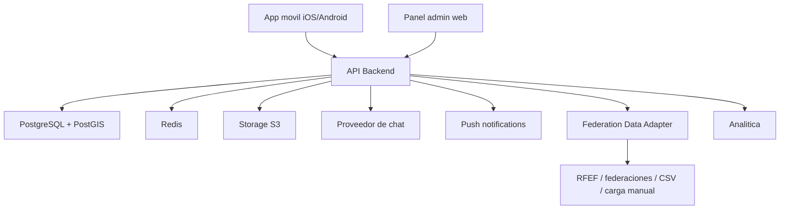

# Arquitectura tecnica

## Vista general



## Aplicaciones

### App movil

Tecnologia propuesta:

- React Native.
- Expo.
- TypeScript.

Responsabilidades:

- Registro/login.
- Onboarding de jugador y club.
- Perfil deportivo.
- Busqueda de oportunidades.
- Postulaciones.
- Chat o mensajeria.
- Notificaciones.
- Ajustes de privacidad.

### Panel administrativo

Tecnologia propuesta:

- Next.js.
- TypeScript.

Responsabilidades:

- Revision de clubes.
- Revision de responsables.
- Moderacion de usuarios y publicaciones.
- Gestion de reportes.
- Importacion de datos federativos.
- Resolucion de duplicados.
- Auditoria de acciones sensibles.

### Backend

Tecnologia propuesta:

- NestJS.
- TypeScript.
- API REST para MVP.

Responsabilidades:

- Autenticacion.
- Autorizacion por roles.
- Perfiles.
- Clubes y equipos.
- Busquedas.
- Postulaciones.
- Integracion con chat.
- Moderacion.
- Notificaciones.
- Datos federativos.
- Auditoria.

## Modulos del backend

```text
identity
users
players
clubs
teams
opportunities
applications
messaging
moderation
federation-data
notifications
media
analytics
admin
audit
```

## Base de datos

PostgreSQL sera la base principal. PostGIS permitira buscar por distancia:

- Jugadores cerca de un club.
- Oportunidades cerca de un jugador.
- Clubes en una zona.

## Redis

Usos iniciales:

- Rate limiting.
- Colas ligeras.
- Cache de consultas repetidas.
- Tokens temporales.
- Eventos de notificacion.

## Storage

Usos:

- Foto de perfil.
- Imagenes de club.
- Documentos de verificacion.
- Videos no recomendados en MVP salvo enlaces externos.

Para el MVP se recomienda permitir enlaces a video en lugar de subir video pesado a la plataforma.

## Despliegue recomendado

### Desarrollo

- App local con Expo.
- Backend local.
- PostgreSQL local o gestionado.
- Redis local.

### Staging

- Entorno de pruebas con datos no productivos.
- App interna.
- Panel admin protegido.

### Produccion

- Backend en contenedor.
- PostgreSQL gestionado.
- Redis gestionado.
- Storage gestionado.
- Backups automaticos.
- Monitorizacion y alertas.

## Estrategia de crecimiento

Primero monolito modular. Separar servicios solo cuando exista presion real:

- Chat propio si el proveedor externo se vuelve caro o limitante.
- Servicio federativo separado si crecen los conectores.
- Busqueda dedicada si PostgreSQL ya no alcanza.
- Procesamiento de media si se habilitan videos propios.
