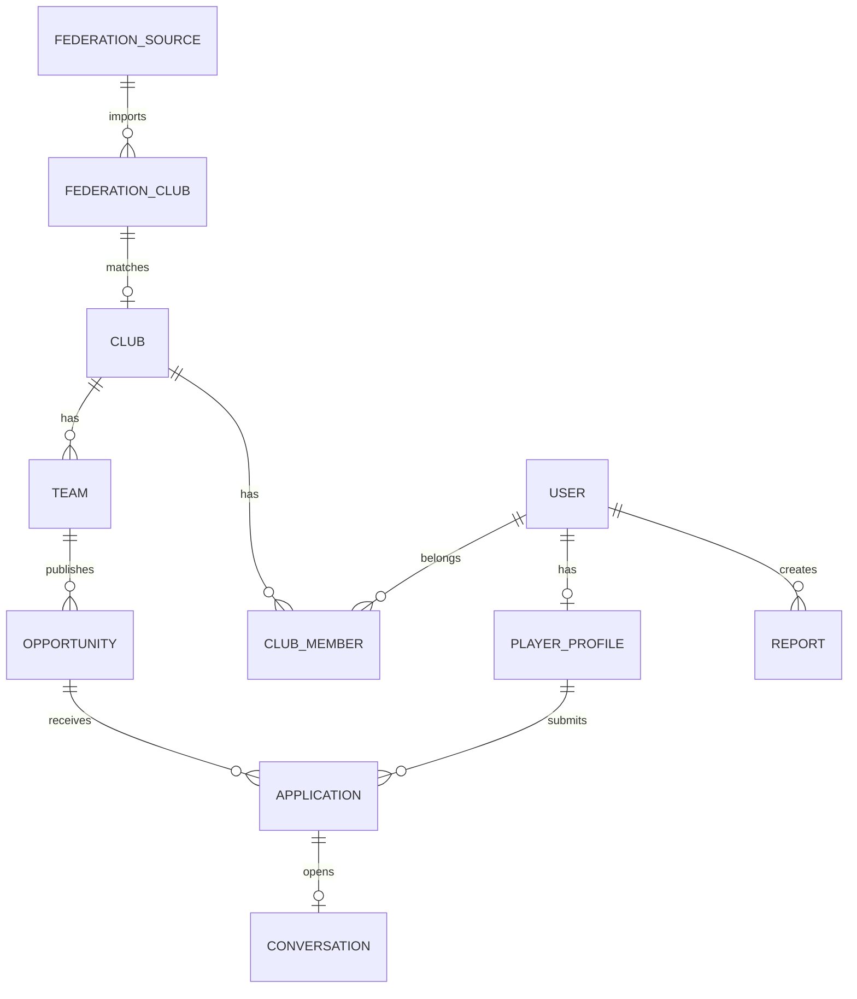

# Modelo de datos inicial

## Entidades principales

## users

Representa la cuenta de acceso.

Campos sugeridos:

- id
- email
- phone
- password_hash
- full_name
- date_of_birth
- country
- locale
- status: active, pending_verification, suspended, deleted
- created_at
- updated_at

## player_profiles

Perfil deportivo del jugador.

Campos sugeridos:

- id
- user_id
- display_name
- birth_year
- gender: male, female, other, prefer_not_to_say
- primary_position
- secondary_positions
- dominant_foot
- height_cm
- weight_kg
- current_club_name
- last_club_name
- category
- modality: football_11, football_7, futsal
- availability_status
- location_lat
- location_lng
- location_label
- search_radius_km
- bio
- video_links
- visibility_level: public, clubs_only, hidden
- is_minor
- guardian_consent_status: not_required, pending, approved, rejected
- created_at
- updated_at

## guardians

Representa padre, madre o tutor si se activan menores.

Campos sugeridos:

- id
- player_profile_id
- full_name
- email
- phone
- relationship
- consent_status
- consent_at
- created_at

## clubs

Club dentro de la plataforma.

Campos sugeridos:

- id
- name
- normalized_name
- federation_region
- city
- province
- country
- website
- contact_email
- logo_asset_id
- verification_status: unverified, pending, verified, rejected
- federation_match_status: unmatched, suggested, matched, conflict
- created_at
- updated_at

## club_members

Usuarios asociados a clubes.

Campos sugeridos:

- id
- club_id
- user_id
- role: owner, director, coach, coordinator, delegate, staff
- permissions
- verification_status: pending, verified, rejected, revoked
- verification_method: email_domain, federation_email, document, manual, phone
- created_at
- updated_at

## teams

Equipo especifico dentro de un club.

Campos sugeridos:

- id
- club_id
- name
- category
- gender
- modality
- season
- competition_name
- federation_team_ref
- created_at
- updated_at

## opportunities

Busqueda publicada por un club/equipo.

Campos sugeridos:

- id
- club_id
- team_id
- created_by_user_id
- title
- description
- category
- gender
- modality
- primary_position
- secondary_positions
- age_min
- age_max
- location_lat
- location_lng
- location_label
- level
- opportunity_type: trial, immediate_join, next_season
- requirements
- deadline_at
- status: draft, pending_review, active, paused, closed, rejected
- created_at
- updated_at

## applications

Postulacion de jugador a una busqueda.

Campos sugeridos:

- id
- opportunity_id
- player_profile_id
- message
- status: submitted, viewed, shortlisted, contacted, trial_scheduled, rejected, withdrawn, accepted
- created_at
- updated_at

## conversations

Conversacion vinculada preferentemente a una postulacion.

Campos sugeridos:

- id
- application_id
- provider
- provider_conversation_id
- status: active, blocked, reported, archived
- created_at
- updated_at

## reports

Reportes de seguridad y moderacion.

Campos sugeridos:

- id
- reporter_user_id
- reported_user_id
- related_entity_type
- related_entity_id
- reason
- description
- status: open, reviewing, resolved, dismissed
- created_at
- resolved_at

## federation_sources

Fuente de datos federativos.

Campos sugeridos:

- id
- name
- type: api, csv, manual, web_public
- region
- terms_notes
- last_import_at
- status

## federation_clubs

Club importado de una fuente federativa.

Campos sugeridos:

- id
- federation_source_id
- external_id
- official_name
- normalized_name
- city
- region
- website
- raw_payload
- last_seen_at

## audit_logs

Registro de acciones sensibles.

Campos sugeridos:

- id
- actor_user_id
- action
- entity_type
- entity_id
- previous_value
- new_value
- ip_address
- created_at

## Reglas importantes

- Una publicacion activa requiere club verificado y responsable verificado.
- Un chat se abre desde una postulacion cuando el club decide contactar al candidato.
- Si hay menores activados, el consentimiento debe existir antes de permitir contacto.
- Los datos federativos importados no reemplazan datos del club sin revision.
- Los perfiles deben tener controles de visibilidad desde el MVP.
