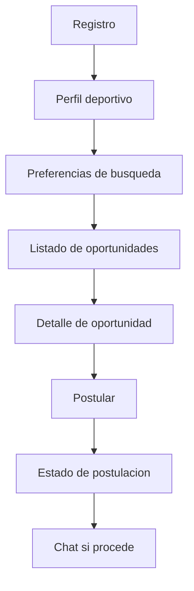
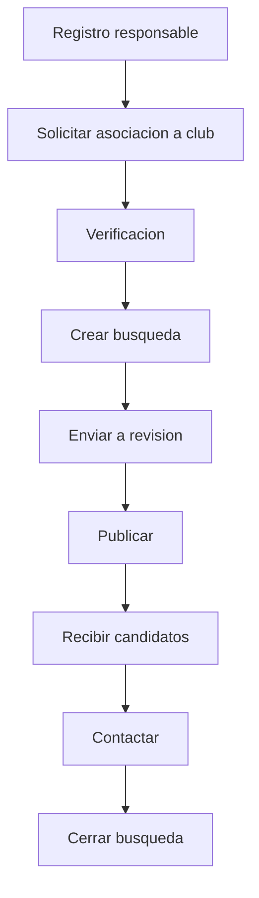

# UX y flujos

## Principio de experiencia

La app debe sentirse practica y confiable. No debe parecer una red social abierta, sino una herramienta para encontrar oportunidades reales de futbol.

## Navegacion movil propuesta

Jugador:

```text
Inicio
Buscar
Postulaciones
Mensajes
Perfil
```

Club/responsable:

```text
Inicio
Busquedas
Candidatos
Mensajes
Club
```

Un usuario que sea jugador y responsable de club puede cambiar de modo desde el perfil.

## Onboarding

### Paso 1 - Tipo de cuenta

- Soy jugador.
- Soy responsable de club.
- Soy entrenador.

### Paso 2 - Datos basicos

- Nombre.
- Email.
- Fecha de nacimiento.
- Ubicacion.

### Paso 3 - Perfil especifico

Jugador:

- Posicion.
- Categoria.
- Modalidad.
- Disponibilidad.
- Radio de busqueda.

Responsable:

- Club.
- Rol.
- Email asociado.
- Solicitud de verificacion.

## Flujo jugador



## Flujo club



## Pantallas MVP jugador

- Splash / inicio.
- Registro/login.
- Seleccion de rol.
- Crear perfil jugador.
- Completar preferencias.
- Home con oportunidades recomendadas.
- Busqueda con filtros.
- Detalle de busqueda.
- Postulacion.
- Mis postulaciones.
- Mensajes.
- Perfil.
- Privacidad.
- Reportar problema.

## Pantallas MVP club

- Registro/login.
- Crear o buscar club.
- Solicitud de asociacion.
- Estado de verificacion.
- Dashboard club.
- Crear busqueda.
- Vista de busquedas.
- Lista de candidatos.
- Detalle candidato.
- Mensajes.
- Ajustes de club.

## Pantallas admin

- Login admin.
- Dashboard.
- Usuarios.
- Clubes pendientes.
- Responsables pendientes.
- Busquedas pendientes.
- Reportes.
- Importaciones federativas.
- Duplicados y matching de clubes.
- Auditoria.

## Estados visibles importantes

Jugador:

- Perfil incompleto.
- Puede postular.
- Ya postulado.
- Postulacion vista.
- Contactado.
- Prueba agendada.
- Descartado.

Club:

- Club sin verificar.
- Responsable pendiente.
- Busqueda en borrador.
- Busqueda pendiente de revision.
- Busqueda activa.
- Busqueda pausada.
- Busqueda cerrada.

## Reglas de UX

- No mostrar datos sensibles del jugador por defecto.
- Mostrar al jugador si el club esta verificado.
- Mostrar al club si el perfil del jugador esta completo.
- Evitar chat directo sin contexto.
- Hacer que reportar y bloquear sea facil.
- Mostrar claramente el estado de cada postulacion.
- No exigir video en MVP.
